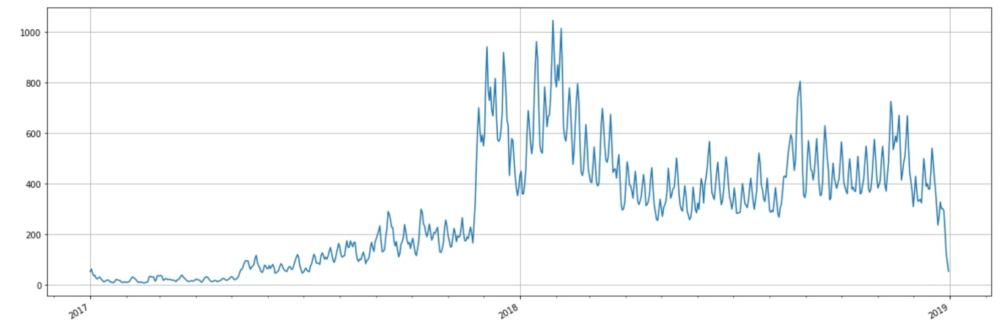
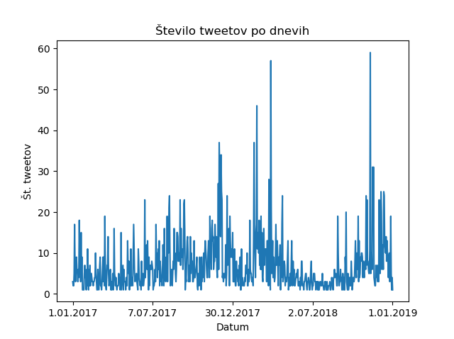
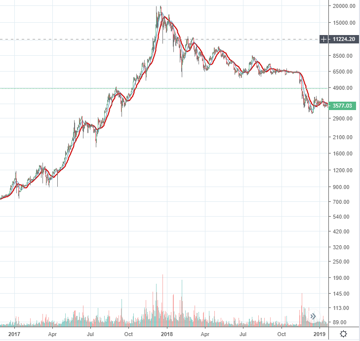

# Raziskava korelacije med različnimi objavami na spletu ter nihanjem kripto valut. 

Projekt, vsebuje podatke in metode, ki smo jih uporabili, da smo analizerali podatke.

## Člani

Člani skupine smo: Gal Mrvar, Avguštin Kastelic, Gregor Novak, Jure Mohar

## Opis problema in cilji

Iz podatkov, bi radi ugotovili, ali obstaja korelacija med objavami na spletu ter nihanjem kripto valut.
Zanima nas ali na ceno oz. volumen kripto valut vplivajo naslednji faktorji:

* Količina twitter objav / člankov
* Pozitivni / negativni tweeti vplivnih twitter računov
* Število všečkov, retweetov

Poleg tega pa lahko iščemo tudi druga zanimiva odstopanja v podatkih.

## Kriterij uspešnost

Radi bi ovrgli ali potrdili našo hipotezo, da mediji in twitter objave vplivajo na ceno kripto valut.

## Opis podatkov

Podatke smo črpali iz večih virov. Vzeli smo obdobje med 1.1.2017 in 1.1.2019 saj je to obdobje zaradi cen kriptovalut najbolj zanimivo za našo raziskavo. 

### 1. Objave vplivnih oseb na Twitterju.

Najprej smo poskusili s twitter API-jem, a brez doplačila seže le en teden nazaj.
Zato smo napisali program, ki preko query search-ov na twitterju bere twitte.
Za začetek smo zbrali twitter objave nekaj najbolj vplivnih twitter računov na območju kriptovalut.

Podatke smo zbrali v csv file: username;date;retweets;favorites;text;geo;mentions;hashtags;id;permalink

### 2. Objave medijev na spletu

S pomočjo Event Registry smo zbrali podatke in vsebino člankov, ki omenjajo koncept kriptovalut. Zbrali smo 220.000 člankov v 39 jezikih.

### 3. Podatki o kriptovalutah

Zaenkrat smo se osredotočili na Bitcoin in s pomočjo CryptoCompare API pridobili dnevne podatke v izbranem obdobju o ceni in volumnu. Pridobljene podatke v JSON formatu smo pretvorili v CSV format za lažje branje iz datoteke. Podatki vključujejo:

* čas v obliki timestamp
* close
* high
* low
* open
* volumefrom
* volumeto

Vrednosti so v valuti USD.

## Analiza vsebine objav

Objave smo poskusili klasificirati na tri kategorije:

* pozitivno
* negativno
* nevtralno

Za analizo smo večinoma uporabili Python knjižnico TextBlb, poleg tega pa uporabljamo tudi API od MonkeyLearn.
Trenutna ocena uspešnosti klasifikatorja: 

* 44% (62 testnih primerov)

Cilj: Izboljšanje klasifikatorja.

## Analize

Frekvenca člankov po dnevih:

Frekvenca objav na Twitterju po dnevih:

Cena kriptovalut po dnevih:

## Ugotovitve

Iz trenutnih grafov lahko vidimo, da smo na dobri poti in da najvrjetneje obstaja korelacija med ceno oz. volumnom ter objavami na spletu.
